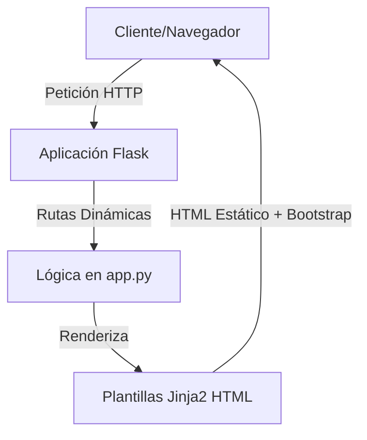

# 📖 Libro de Proyectos y Portafolio Académico: Tareas de Python

¡Bienvenido al manual y compendio oficial del repositorio **Tareas-de-python**! Este documento está estructurado de manera pedagógica a manera de libro de desarrollo de software. Aquí encontrarás la documentación técnica, los fundamentos arquitectónicos y los procesos de ejecución de cada uno de los proyectos y laboratorios construidos a lo largo del proceso académico.

---

## 🗺️ Índice de Contenidos

* [**Prólogo: Introducción al Portafolio**](#-prólogo-introducción-al-portafolio)
* [**Capítulo 1: Fundamentos y Scripts de Lógica Algorítmica (`Sueltos/`)**](#-capítulo-1-fundamentos-y-scripts-de-lógica-algorítmica-sueltos)
  * [1.1. Script de Lógica Nathan Olmos (`Nathan_Olmos.py`)](#11-script-de-lógica-nathan-olmos-nathan_olmospy)
  * [1.2. Laboratorio Clase 3 (`Tarea_clase3.py`)](#12-laboratorio-clase-3-tarea_clase3py)
* [**Capítulo 2: Desarrollo Web con Flask (Micro-Framework)**](#-capítulo-2-desarrollo-web-con-flask-micro-framework)
  * [2.1. Plantillas Dinámicas e Inyección de Variables (`jinja2/`)](#21-plantillas-dinámicas-e-inyección-de-variables-jinja2)
  * [2.2. Ruteo Dinámico y Controladores Matemáticos (`mi_app/`)](#22-ruteo-dinámico-y-controladores-matemáticos-mi_app)
  * [2.3. Aplicación Evaluativa Intermedia (`Parcial2/`)](#23-aplicación-evaluativa-intermedia-parcial2)
* [**Capítulo 3: Aplicaciones Web Corporativas con Django (Framework de Alto Nivel)**](#-capítulo-3-aplicaciones-web-corporativas-con-django-framework-de-alto-nivel)
  * [3.1. Núcleo de Gestión Académica (`universidad_project/`)](#31-núcleo-de-gestión-académica-universidad_project)
  * [3.2. Sistema de Gestión de Eventos Universitarios (`universidad_eventos/`)](#32-sistema-de-gestión-de-eventos-universitarios-universidad_eventos)
* [**Capítulo 4: Guía Práctica de Configuración y Puesta en Marcha**](#-capítulo-4-guía-práctica-de-configuración-y-puesta-en-marcha)
  * [4.1. Configuración del Entorno Virtual (.venv)](#41-configuración-del-entorno-virtual-venv)
  * [4.2. Instalación de Dependencias](#42-instalación-de-dependencias)
  * [4.3. Migración y Carga de Datos en Django](#43-migración-y-carga-de-datos-en-django)
* [**Epílogo: Criterios de Calidad y Buenas Prácticas**](#-epílogo-criterios-de-calidad-y-buenas-prácticas)

---

## 💡 Prólogo: Introducción al Portafolio

Este repositorio sirve como bitácora de aprendizaje del desarrollo de software en **Python**, transitando desde la lógica procedural y estructurada hasta la creación de complejas aplicaciones web utilizando dos de los frameworks más representativos del ecosistema:
1. **Flask:** Un micro-framework minimalista, ágil y altamente modular ideal para entender el flujo HTTP, el ruteo y la integración de plantillas Jinja2 desde sus bases.
2. **Django:** Un framework "baterías incluidas" robusto, seguro y estructurado bajo el patrón MVT (Modelo-Vista-Template), ideal para construir aplicaciones empresariales que requieren bases de datos relacionales, paneles de control administrativos y validación estricta de datos.

---

## 🛠️ Capítulo 1: Fundamentos y Scripts de Lógica Algorítmica (`Sueltos/`)

Este capítulo agrupa los scripts que sirvieron como bases prácticas para afianzar conceptos de tipado dinámico, condicionales, ciclos, manejo de excepciones y colecciones en Python.

### 1.1. Script de Lógica Nathan Olmos (`Nathan_Olmos.py`)
* **Ubicación:** `Sueltos/Nathan_Olmos.py`
* **Descripción:** Script interactivo diseñado para evaluar lógica de control del flujo de ejecución de datos. Desarrolla algoritmos de cálculo matemático e interacción con el usuario mediante consola.
* **Flujo de Ejecución:**
  1. Solicita la entrada de parámetros por consola.
  2. Implementa filtros condicionales para validar las entradas de usuario.
  3. Ejecuta bucles y muestra los resultados formateados en texto plano.

### 1.2. Laboratorio Clase 3 (`Tarea_clase3.py`)
* **Ubicación:** `Sueltos/Tarea_clase3.py`
* **Descripción:** Laboratorio enfocado en funciones puras y manipulación de listas/diccionarios en Python.
* **Conceptos Clave:** Definición de funciones con `def`, retorno de múltiples valores, loops con `for` y formateo de cadenas de texto modernas (`f-strings`).

---

## 🌐 Capítulo 2: Desarrollo Web con Flask (Micro-Framework)

Flask permite entender cómo funciona la web desde la base. En este capítulo se documentan tres desarrollos interactivos creados con este framework.



### 2.1. Plantillas Dinámicas e Inyección de Variables (`jinja2/`)
* **Ubicación:** `jinja2/`
* **Descripción:** Aplicación diseñada para entender la sintaxis del motor de plantillas **Jinja2** integrado en Flask.
* **Componentes:**
  * `app.py`: Controlador que define las rutas web y envía colecciones de datos (listas, diccionarios) al frontend.
  * `templates/`: Archivos HTML enriquecidos con sentencias condicionales (``), bucles repetitivos (``) e inyección de datos (`{{ variable }}`).

### 2.2. Ruteo Dinámico y Controladores Matemáticos (`mi_app/`)
* **Ubicación:** `mi_app/`
* **Descripción:** Ejercicio avanzado que demuestra el poder de las **rutas dinámicas** en Flask. Recibe el nombre de un estudiante y tres notas numéricas directamente de la URL, procesa los datos y renderiza un boletín académico estilizado.
* **Flujo:**
  * Ruta configurada: `/estudiante/<nombre>/<float:nota1>/<float:nota2>/<float:nota3>`
  * La aplicación captura los segmentos de la URL, calcula el promedio aritmético/ponderado y valida si el estudiante aprueba o reprueba.
  * Renderiza una plantilla responsiva que cambia de color de fondo según la calificación del alumno.

### 2.3. Aplicación Evaluativa Intermedia (`Parcial2/`)
* **Ubicación:** `Parcial2/`
* **Descripción:** Proyecto estructurado para una evaluación académica intermedia. Integra múltiples vistas, menús de navegación, y un diseño modular y responsivo para resolver problemas de negocio específicos mediante Flask.

---

## 🗄️ Capítulo 3: Aplicaciones Web Corporativas con Django (Framework de Alto Nivel)

Django ofrece un entorno de desarrollo profesional con seguridad incorporada, mapeador objeto-relacional (ORM) y administración automática de bases de datos.

### 3.1. Núcleo de Gestión Académica (`universidad_project/`)
* **Ubicación:** `universidad_project/`
* **Descripción:** Proyecto inicial enfocado en el modelado relacional académico. Define la base del comportamiento estudiantil, las matrículas y los profesores a través de modelos de base de datos relacionales integrados con SQLite.

### 3.2. Sistema de Gestión de Eventos Universitarios (`universidad_eventos/`)
* **Ubicación:** `universidad_eventos/`
* **Descripción:** Aplicación web completa y profesional diseñada para el **Sistema de Gestión de Eventos Universitarios** del campus. Implementa un catálogo en tiempo real con control estricto de aforos y alertas visuales.

```text
universidad_eventos/
├── db.sqlite3                <-- Base de datos física
├── manage.py                 <-- Utilidad de consola de Django
├── universidad_eventos/       <-- Carpeta de configuración del proyecto
└── eventos/                  <-- App modular de la lógica de negocio
    ├── fixtures/
    │   └── eventos_iniciales.json <-- 10 eventos universitarios listos
    └── templates/
        └── eventos/
            ├── base.html     <-- Navbar premium y footer
            ├── index.html    <-- Cuadro de control estadístico
            ├── eventos.html  <-- Tabla interactiva y buscador
            └── nuevo_evento.html <-- Formulario con validador de aforo
```

* **Características Clave:**
  * **Integridad del Modelo (`models.py`):** Lógica del modelo `Evento` que impide ingresar aforos imposibles (inscritos > cupos) o valores negativos de aforo mediante validación en `clean()`.
  * **Vistas Funcionales (FBV) y Django ORM (`views.py`):** Uso avanzado de sentencias del ORM como `count()`, `order_by()`, `filter()` combinados con expresiones lógicas `Q` e inyección de campos mediante la clase `F` para optimizar consultas de aforo en SQL.
  * **Formulario Estilizado (`forms.py`):** Un `ModelForm` enriquecido con clases CSS de Bootstrap 5 e inteligencia propia para bloquear el ingreso de eventos con fechas en el pasado.
  * **Buscador Integrado:** Filtrado de eventos dinámico por coincidencia en nombre o facultad organizadora directamente en el frontend.
  * **Control Visual de Plazas:** Visualización de aforo mediante barras de progreso dinámicas y badges de disponibilidad ("Disponible" en verde si quedan cupos o "Agotado" en rojo si el aforo está al 100%).

---

## 🚀 Capítulo 4: Guía Práctica de Configuración y Puesta en Marcha

Para compilar y ejecutar cualquiera de los proyectos del portafolio en tu máquina, sigue estos pasos estructurados:

### 4.1. Configuración del Entorno Virtual (.venv)
Es altamente recomendable aislar las librerías del proyecto. Ubícate en la carpeta raíz `Tareas-de-python` y ejecuta:

```bash
# 1. Crear el entorno virtual
python -m venv .venv

# 2. Activar el entorno virtual (En Windows)
.venv\Scripts\activate

# 3. Activar el entorno virtual (En macOS / Linux)
source .venv/bin/activate
```
*Sabrás que está activo porque tu línea de comandos iniciará con el prefijo `(.venv)`.*

### 4.2. Instalación de Dependencias
Una vez activado el entorno, instala los paquetes requeridos por Flask y Django en tu máquina:
```bash
pip install flask django
```

### 4.3. Migración y Carga de Datos en Django
Para el proyecto del **Sistema de Gestión de Eventos Universitarios** (`universidad_eventos`), la base de datos SQLite ya cuenta con toda la información migrada y poblada. Si deseas reconstruirla desde cero en otro equipo, ejecuta los siguientes comandos:

```bash
# Ubícate en la carpeta del proyecto
cd universidad_eventos

# Generar archivos de migración abstractos
python manage.py makemigrations eventos

# Crear físicamente las tablas en la base de datos db.sqlite3
python manage.py migrate

# Cargar automáticamente los 10 eventos universitarios de prueba
python manage.py loaddata eventos_iniciales.json

# Crear una cuenta de administrador para el panel de control
python manage.py createsuperuser

# Encender el servidor local de desarrollo
python manage.py runserver
```

---

## 🎨 Epílogo: Criterios de Calidad y Buenas Prácticas

Todos los proyectos listados en este portafolio han sido construidos bajo rigurosas directrices de ingeniería de software:
* **Separación de Responsabilidades:** Lógica de datos (Modelos/Controladores) aislada de la lógica de presentación (HTML/CSS con Bootstrap).
* **Código Limpio (Clean Code):** Comentarios descriptivos en español explicativos de cada bloque de código, variables con nomenclatura autodescriptiva y funciones modulares.
* **Seguridad Primero:** Prevención de ataques CSRF (Cross-Site Request Forgery) mediante tokens integrados en formularios y protección contra inyecciones SQL a través del uso estricto del ORM de Django.
* **Diseño Responsivo:** Uso de rejillas flexibles de Bootstrap 5 para garantizar una excelente visualización y usabilidad del sistema desde computadores de escritorio, tabletas y teléfonos celulares.
